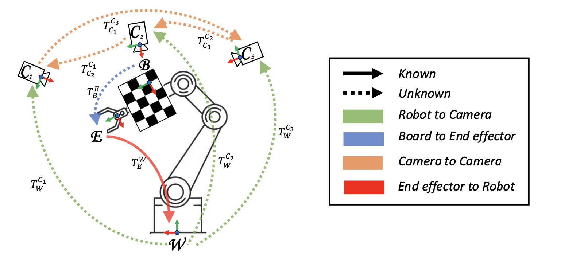

# Multi-Camera Hand-Eye Calibration for Human-Robot Collaboration in Industrial Robotic Workcells
## 📝 Abstract
In industrial scenarios, effective human-robot collaboration relies on multi-camera systems to robustly monitor human operators despite the occlusions that typically show up in a robotic workcell. In this scenario, precise localization of the person in the robot coordinate system is essential, making the hand-eye calibration of the camera network critical. This process presents significant challenges when high calibration accuracy should be achieved in short time to minimize production downtime, and when dealing with extensive camera networks used for monitoring wide areas, such as industrial robotic workcells. Our paper introduces an innovative and robust multi-camera hand-eye calibration method, designed to optimize each camera’s pose relative to both the robot’s base and to each other camera. This optimization integrates two types of key constraints: i) a single board-to-end-effector transformation, and ii) the relative camera-to-camera transformations. We demonstrate the superior performance of our method through comprehensive experiments employing the METRIC dataset and real-world data collected on industrial scenarios, showing notable advancements over state-of-the-art techniques even using less than 10 images. 

📄 [**RAL Paper: Multi-Camera Hand-Eye Calibration for Human-Robot Collaboration in Industrial Robotic Workcells**](https://ieeexplore.ieee.org/stamp/stamp.jsp?arnumber=10694716)


> ℹ️ **Note**: This repository supports both **multi-camera** and **single-camera** configurations, and works for both **eye-in-hand** and **eye-on-base** calibration setups.

---

## ⚙️ Installation

Clone the repository:

```
git clone https://github.com/davidea97/Multi-Camera-Hand-Eye-Calibration.git
cd Multi-Camera-Hand-Eye-Calibration
```

Make sure the following dependencies are installed:

* [Ceres Solver](http://ceres-solver.org/)
* OpenCV ≥ 4.2
* Eigen ≥ 3.3.7

Then compile the code:

```bash
mkdir build
cd build
cmake ..
make -j8
```


## 📁 Dataset Structure

Your dataset should follow this structure:

```
data/
└── <your_data_folder>/
    ├── camera1/
    │   ├── image/
    │   ├── pose/
    │   └── intrinsic_pars_file.yaml
    ├── camera2/
    ├── ...
    └── CalibrationInfo.yaml
```

### File Descriptions

#### `CalibrationInfo.yaml`

This file defines all calibration parameters. Here's an example:

```yaml
number_of_cameras: 4                  # Total number of cameras
camera_folder_prefix: camera          # Prefix for camera folders
pattern_type: checkerboard            # Calibration pattern

number_of_rows: 4                     # Inner corners in vertical direction
number_of_columns: 3                  # Inner corners in horizontal direction
size: 0.05                            # Size of squares (in meters)

resize_factor: 1                      # Resize images to speed up detection
visual_error: 1                       # Store reprojection results (1 = yes)
calibration_setup: 1                  # 0 = eye-in-hand, 1 = eye-on-base
```


#### Camera Folders (`cameraX/`)

Each camera folder must contain:

* `image/`: Contains images (`0000.png`, `0001.png`, ...) captured by the camera.
  ⚠️ All cameras must have the **same number of images**, even if the chessboard is not visible — the code handles this internally.

* `pose/`: Contains `.csv` files (`0000.csv`, `0001.csv`, ...) representing 4×4 robot poses (as provided by odometry). Each CSV contains the first row of a 4×4 transformation matrix.

* `intrinsic_pars_file.yaml`: Contains the intrinsic calibration of the camera:

```yaml
fx: 1108.509382382374
fy: 1108.509382382374
cx: 640.5
cy: 360.5
has_dist_coeff: 1
dist_k0: 0.0
dist_k1: 0.0
dist_px: 0.0
dist_py: 0.0
dist_k2: 0.0
dist_k3: 0
dist_k4: 0
dist_k5: 0
img_width: 1280
img_height: 720
```

---

## 🚀 Running the Calibration



Once everything is compiled, run the calibration:

```bash
cd build
./MC_HEC_calibrator ../data/<your_data_folder>/
```

---

## 📖 Citation

If you use this work in your research, please cite:

```bibtex
@article{allegro2024multi,
  title={Multi-camera hand-eye calibration for human-robot collaboration in industrial robotic workcells},
  author={Allegro, Davide and Terreran, Matteo and Ghidoni, Stefano},
  journal={IEEE Robotics and Automation Letters},
  year={2024},
  publisher={IEEE}
}
```

